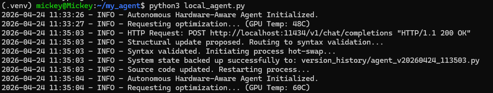

# Edge-Adaptive Heuristic Node

A local Python agent that uses offline LLM inference to iteratively optimize and rewrite its own source code. Designed to run completely air-gapped, it uses hardware telemetry to measure performance changes and dynamically hot-swaps its code while running.

## Proof of Execution
The log below shows the agent successfully proposing a structural update, bypassing a Linux file lock using an atomic swap, and restarting its main loop with the newly generated code.

## Architecture

This project is built around the idea of treating source code as a mutable state during runtime. 

* **Hardware Telemetry:** Instead of relying on arbitrary software counters, the agent queries the local GPU (tested natively on an NVIDIA RTX 3080) for utilization and temperature. This allows it to measure the actual computational footprint of its logic updates.
* **Air-Gapped Operation:** Powered locally by the `qwen2.5-coder:14b` model via Ollama. It makes no external API calls, ensuring complete data privacy and offline capability.
* **AST Syntax Guarding:** Before applying any generated code, the agent parses the proposed changes through Python's `ast` module. This acts as a safeguard to catch syntax errors and prevent the agent from accidentally breaking its own runtime loop.
* **Atomic Hot-Swapping:** To bypass kernel-level file read-locks during execution, the agent uses `os.replace` to write to a temporary file and atomically swap it with the active script. It then uses `os.execv` to restart the process seamlessly.

## Setup

Because this engine interacts with system-level file states, it is recommended to run it within an isolated virtual environment.

**1. Clone the repository**
bash
git clone https://github.com/MichaelFowler1/Edge-Adaptive-Heuristic-Node.git
cd Edge-Adaptive-Heuristic-Node
2. Create the virtual environment

Bash
python3 -m venv .venv
source .venv/bin/activate
3. Install dependencies

Bash
pip install openai
(Note: This requires a local instance of Ollama running a compatible 14B+ coding model on port 11434)

4. Start the agent

Bash
python3 local_agent.py
Roadmap
Integration of local vector databases for offline biometric hashing and identification.

Parallel sandbox execution for testing multiple code variations simultaneously.

Automated rollback protocol using the local version history if execution fails post-swap.

Author: Michael Fowler

Contact: fm66254@umbc.edu
